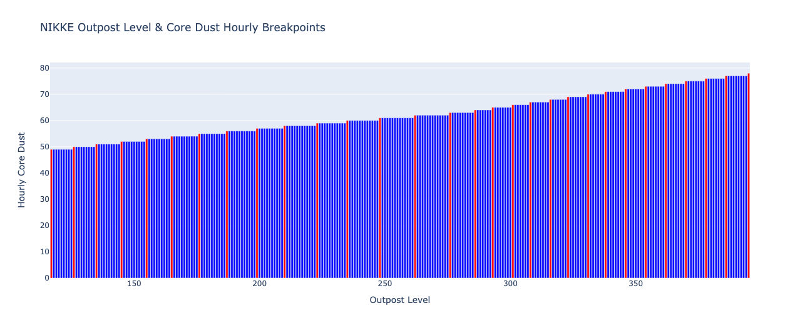

# Nikke Core Dust Breakpoints 

While the exact core dust gain might vary between players, the chart generated by this Python notebook can provide valuable insights. By analyzing the core dust levels across different outpost levels, we can identify clear breakpoints. These breakpoints, represented by jumps in the bar chart, indicate significant increases in core dust production. Focusing on reaching these specific outpost levels can significantly improve your core dust acquisition rate in Nikke, ultimately benefiting character and equipment development.

The data is sourced from Reddit, Nikke Discord, & my personal outpost levels.



- **Nikke Reddit**: [https://www.reddit.com/r/NikkeMobile/comments/1bh4n2v/about_core_dust/](https://www.reddit.com/r/NikkeMobile/comments/1bh4n2v/about_core_dust/)
- 
**Creating a Bar Chart in Python with Plotly**

This code snippet utilizes the Plotly library in Python to create a bar chart visualizing the relationship between "outpost level" and "core dust".

**1. Importing Library:**

```python
import plotly.graph_objects as go
```

- We import the `plotly.graph_objects` submodule as `go`. This submodule provides functionalities for creating various chart types in Plotly.

**2. Data Preparation:**

```python
data = {
    "outpost level": [[117, 49], [126, 50], [135, 51], [145, 52], [155, 53], [165, 54], [176, 55], [187, 56], [199, 57], [210, 58], [223, 59], [235, 60], [248, 61], [262, 62], [276, 63], [286, 64], [293, 65], [301, 66], [308, 67], [316, 68], [323, 69], [331, 70], [338, 71], [346, 72], [354, 73], [362, 74], [370, 75], [378, 76], [386, 77], [395, 78]]
}
```

- A dictionary named `data` is created to store the data points. This data represents the "outpost level" (x-axis) and its corresponding "core dust" (y-axis) values. 
- You can replace this data with your actual data points in a similar format (list of lists within a dictionary).

**3. Chart Definition:**

```python
fig = go.Figure()
```

- We create a `go.Figure` object named `fig`. This object serves as the canvas for building the chart.

**4. Adding Trace (Bars):**

```python
fig.add_trace(go.Bar(
    x=[row[0] for row in data["outpost level"]],  # Extract x-axis values (outpost level)
    y=[row[1] for row in data["outpost level"]],  # Extract y-axis values (core dust)
    name="Core Dust Level"
))
```

- The `fig.add_trace` method is used to add a chart element (trace) to the figure. 
- Here, we add a `go.Bar` trace, which creates a bar chart.
    - `x`: This extracts the "outpost level" values (first element in each sub-list) from the `data` dictionary using list comprehension. 
    - `y`: This extracts the "core dust" values (second element in each sub-list) from the `data` dictionary using list comprehension.
    - `name`: This sets the name of the bar series to be displayed in the legend ("Core Dust Level").

**5. Customizing Layout:**

```python
fig.update_layout(
    title="Outpost Level vs. Core Dust",
    xaxis_title="Outpost Level",
    yaxis_title="Core Dust",
)
```

- The `fig.update_layout` method allows us to customize the overall layout of the chart.
    - `title`: This sets the main title of the chart ("Outpost Level vs. Core Dust").
    - `xaxis_title`: This sets the title for the x-axis ("Outpost Level").
    - `yaxis_title`: This sets the title for the y-axis ("Core Dust").

**6. Saving as Webpage:**

```python
fig.write_html("outpost_core_dust.html")
print("Chart saved as outpost_core_dust.html")
```

- Finally, the `fig.write_html` method saves the created chart as an HTML file named "outpost_core_dust.html".
- The `print` statement confirms the successful saving of the chart.
